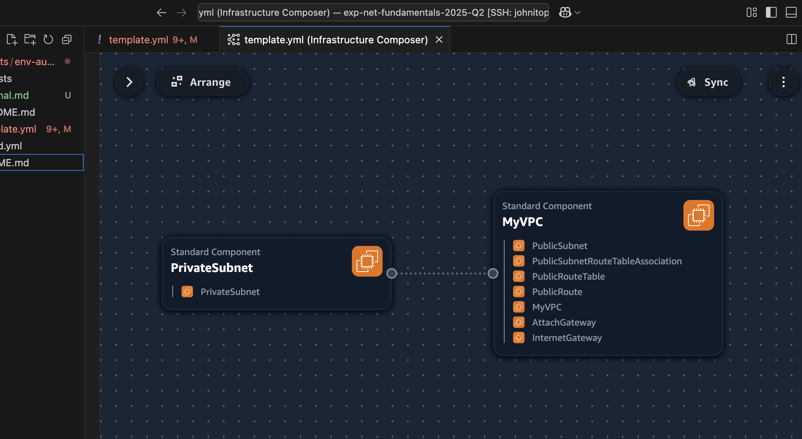
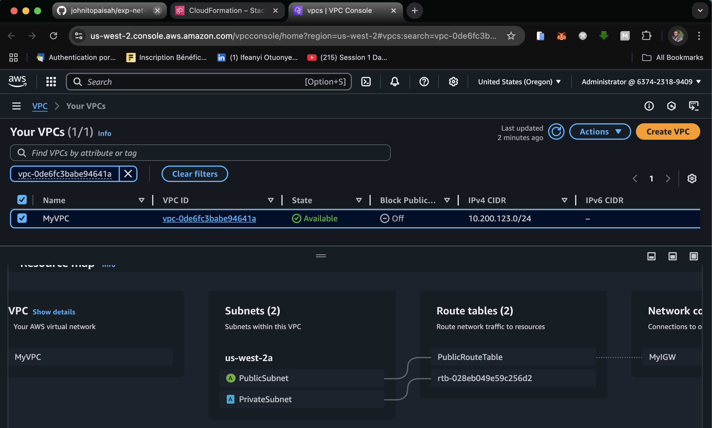

# 🌐 AWS VPC Infrastructure Automation with CloudFormation

This project automates the provisioning of a basic AWS Virtual Private Cloud (VPC) infrastructure using **AWS CloudFormation** and a custom **Bash deployment script**. It is designed for learning, experimentation, and as a base template for production-ready environments.

---

## 📦 What This Project Creates

- A **VPC** with IPv4 CIDR block `10.200.123.0/24`
- 1 **Public Subnet** (`10.200.123.0/25`)
- 1 **Private Subnet** (`10.200.123.128/25`)
- **Internet Gateway** (for public internet access)
- **Route Table** (with a default route to the internet)
- **Route Table Association** (for the public subnet)
- DNS support:
  - ✅ Enable DNS Resolution
  - ✅ Enable DNS Hostnames


---

## 🚀 Getting Started

### ✅ Prerequisites

- An AWS account with CLI access
- [AWS CLI installed](https://docs.aws.amazon.com/cli/latest/userguide/install-cliv2.html)
- AWS credentials configured via `aws configure`
- Bash shell environment (Linux, macOS, WSL, or Gitpod)

---

### 🛠 Deploying the Infrastructure

1. Clone this repository:
   ```bash
   $
   $ git clone https://github.com/johnitopaisah/exp-net-fundamentals-2025-Q2/tree/1-create-cfn-template-setting-up-vpc-in-aws/projects/env-automation.git
   $
   $ cd env-automation
   ```

2. Deploy the stack:
    ```bash
    ./bin/deploy.sh
    ```

The script will:
  - Deploy the CloudFormation template

  - Wait for stack completion

  - Display the outputs (like VPC ID and subnet IDs)

---

### 🗑 Tearing Down the Stack

When you're done, clean up the resources to avoid charges by running the folowing command:

```bash
./bin/delete.sh`
```
⚠️ This will will prompt to enter `yes` to comfirm your action, as this command will delete all AWS resources created by the stack.

---

### 📷 Visuals

To better understand the structure of the deployed VPC, here are visual representations:

- **Infrastructure Composer View**  
  A diagram generated using AWS Infrastructure Composer to visualize the planned architecture.

  

- **Deployed Resource Map**  
  A snapshot of the actual resources deployed in AWS after running the CloudFormation stack.

  

---

### 📚 Documentation

For a detailed breakdown of each step and lessons learned during this project, check out:

📄 [Journal.md](./Journal.md)
