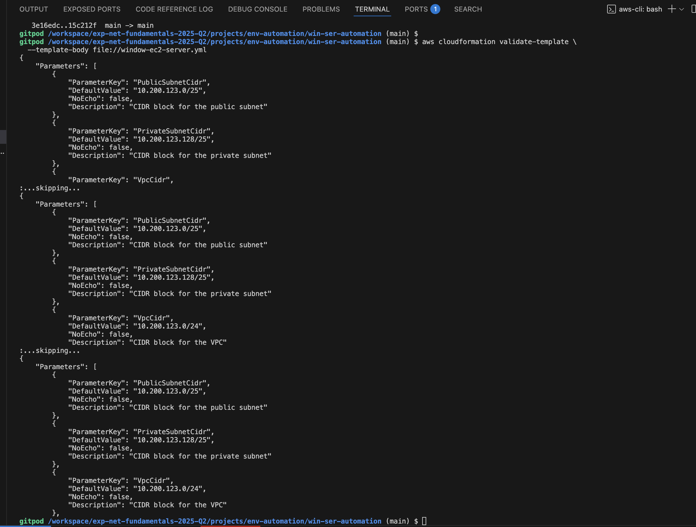
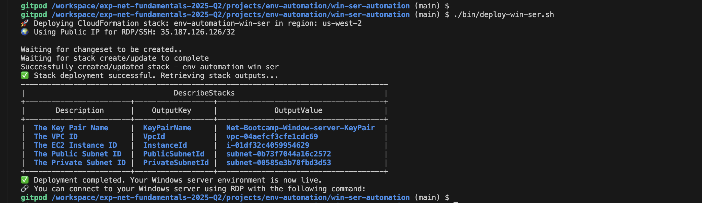
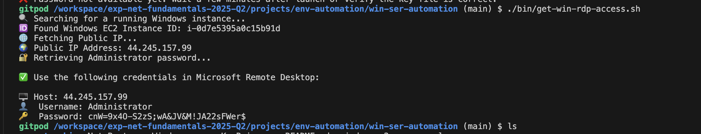
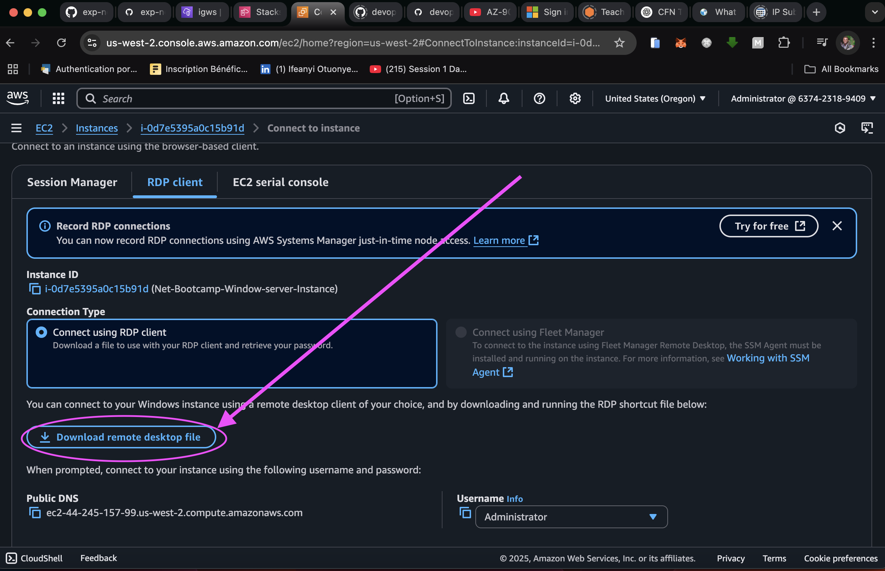
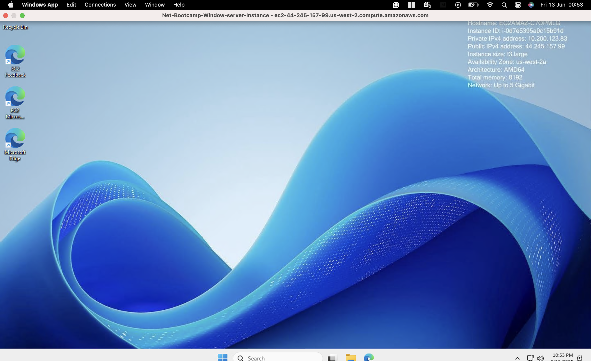
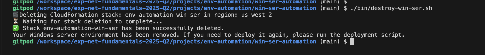

# 🧾 Technical Documentation: Automated Deployment of a Windows Server Environment on AWS Using CloudFormation

### 👨‍💻 Author:  
**John Itopa ISAH**

---

## 📌 Objective  
To design, automate, and validate the deployment of a secure Windows Server 2025 EC2 instance within a custom AWS VPC using **Infrastructure as Code (IaC)** via AWS CloudFormation, Bash scripting, and AWS CLI — followed by a complete teardown of the environment.

---

## 🧰 Tools & Services Used

| Tool/Service              | Purpose                                  |
|---------------------------|------------------------------------------|
| AWS CloudFormation        | Infrastructure-as-Code (IaC)             |
| Amazon EC2                | Hosting the Windows Server               |
| AWS CLI                   | Command-line provisioning                |
| Bash                      | Deployment and teardown scripting        |
| Gitpod + VS Code Terminal | Development & testing environment        |

---

## 🏗️ Infrastructure Design Overview

- **VPC**: `10.200.123.0/24`
- **Public Subnet**: `10.200.123.0/25` (auto-assign public IP)
- **Private Subnet**: `10.200.123.128/25`
- **Internet Gateway**: Routed to the public subnet
- **Security Group**:
  - Allow **RDP (3389)** and **SSH (22)** from `MyIP`
  - Allow all traffic within `10.200.123.0/24`
- **EC2 Instance**:
  - Windows Server 2025 (AMI: `ami-077d884fe0477d60d`)
  - Type: `t3.large`
  - Volume: 125 GiB `gp3`
  - **Secondary ENI** in the private subnet

---

## 📜 CloudFormation Template

Defined in `window-ec2-server.yml` and includes:

- `Parameters`:
  - `VpcCidr`, `PublicSubnetCidr`, `PrivateSubnetCidr`, `AvailabilityZone`, and `MyIP`
- `Resources`:
  - VPC, subnets, route tables, gateway, EC2 instance, security group, ENI
- `Outputs`:  
  Returns instance ID, subnet IDs, VPC ID, and KeyPair name

**Validation Command:**

Validate the template by running the command below from the terminal

```bash
aws cloudformation validate-template \
  --template-body file://window-ec2-server.yml
```

**Output:**

This will display the list of all the resource the stack will provision as shown below



---

## 🚀 Deployment Script: deploy-win-ser.sh

Once the template (`window-ec2-server.yml`) has been validate, you can now move ahead with the deployment of the template by running the deployment script (`deploy-win-ser.sh`) from the terminal,to start the deployment of the resource using CFN template. To do this, we run this command
```bash
  ./bin/deploy.sh
```
⚠️  Please note that, you have to make this script executable by running this command `chmod +x ./bin/desploy.sh` before running the deployment command above.

**📤 Stack Outputs**

This section shows the final output values from the deployed CloudFormation stack.
It includes the EC2 instance ID, VPC ID, subnet IDs, and KeyPair name — serving as proof 
that all resources were provisioned successfully. The screenshot below provides visual 
confirmation of the output in the terminal.



---
## Connect to Your Windows Server on AWS

Before we start this process, we need to make sure that our `.pem` file, (i.e the key `Net-Bootcamp-Window-server-KeyPair.pem`) is copied to the working dir. Once this is confirmed, we now follow these simple steps:

**Step 1: Retrieve Login Credentials:** Use the helper script  [get-win-rdp-access.sh](./bin/get-win-rdp-access.sh) to get:

  - ✅ Public IP address
    
  - ✅ Administrator password

This is done by running the command below:
```bash
  ./bin/get-win-rdp-access.sh
```
*Output*


We are going to use this password (which in my case is `cnW=9x4O-S2zS;wA&JV&M!JA22sFWer$`) to login

**Step 2: 🔽 Download RDP File:** Now, you need to download the RDP file directly from the EC2 console. Go to EC2 Console >> Instance >> Select your instance >> Click Connect >> Under RDP Client


Once downloaded, double-click the `.rdp` file to open Microsoft Remote Desktop - for Mac user, you need to get `Windows App (formally Microsoft Remote Desktop)` from App Store.

When prompted, paste the retrieved password you got from the output of step 1.

✅ You're now inside the Windows EC2 instance.


---
## 🧨 Teardown Process Explained
After successfully deploying and testing your infrastructure, it is important to tear down (destroying) the stack to cleanup Infrastructure which will prevents:

- 🔒 Unintended costs from running resources like EC2 instances and public IPs

- 🧹 Resource sprawl, which can clutter your AWS environment

- 📉 Security risks, by ensuring temporary resources don't persist longer than needed

To do this we are going to use the [bin/destroy-win-ser.sh](./bin/destroy-win-ser.sh) file to achieve this by running the command below from the terminal:
```bash
  ./bin/destroy-win-ser.sh
```

This command will take a little while to finish running, and after the process is commplete, we have the output below:

*Output*


---
## 🔍 Summary
In summary, this project demonstrates the full lifecycle of provisioning and managing a Windows Server 2025 instance on AWS using CloudFormation and Bash scripting:

- ✅ Validated and deployed an EC2 Windows instance with both public and private networking

- 🔑 Integrated Key Pair management for secure RDP access

- 🛡️ Enforced access control via a dynamic Security Group, limited to the deployer’s public IP

- 📜 Automated provisioning with reusable scripts: `deploy-win-ser.sh, get-win-rdp-access.sh,` and `destroy-win-ser.sh`

- 📤 Verified results using aws cloudformation describe-stacks and live RDP connection from macOS

- 🧨 Implemented clean teardown to remove all deployed resources and prevent cost leakage

This exercise showcases best practices in Infrastructure as Code (IaC), secure remote access, and lifecycle automation. It's a strong foundation for integrating Windows workloads into cloud-native pipelines or enterprise-grade deployments.