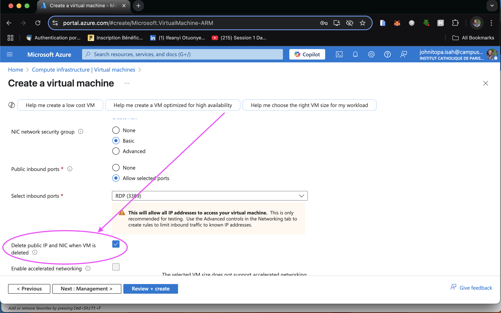
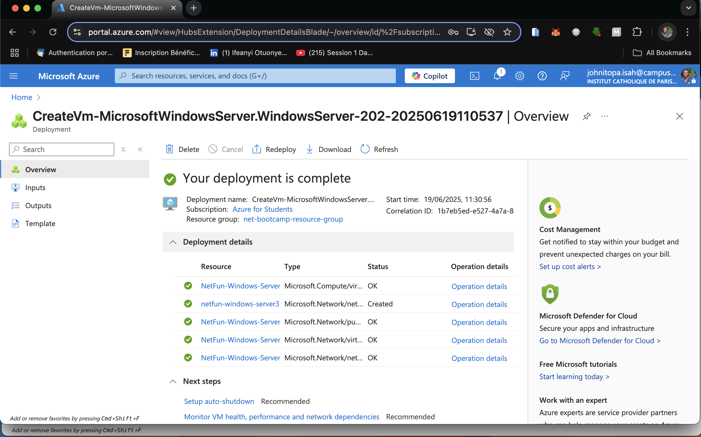
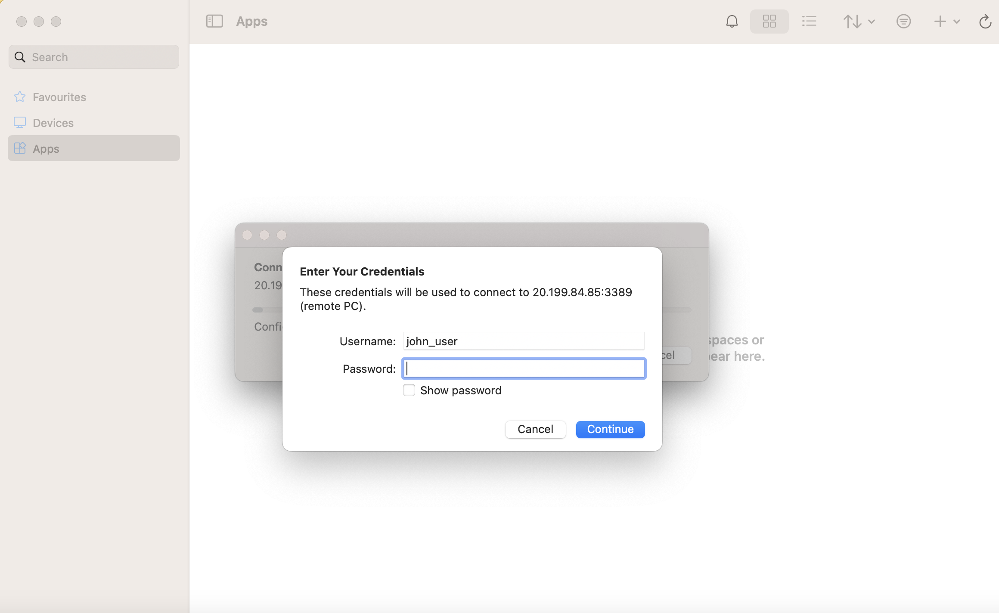
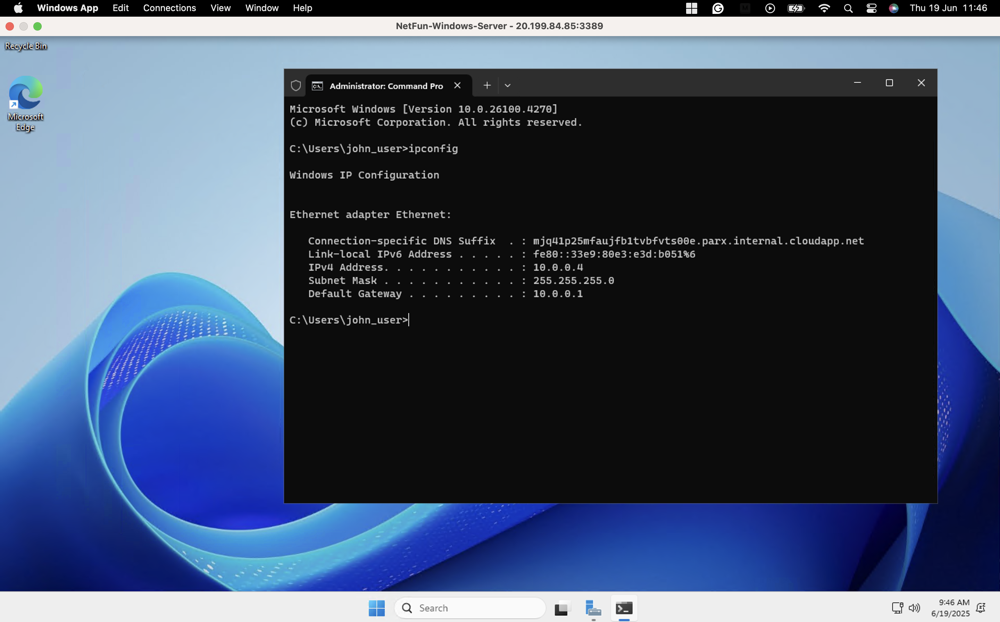
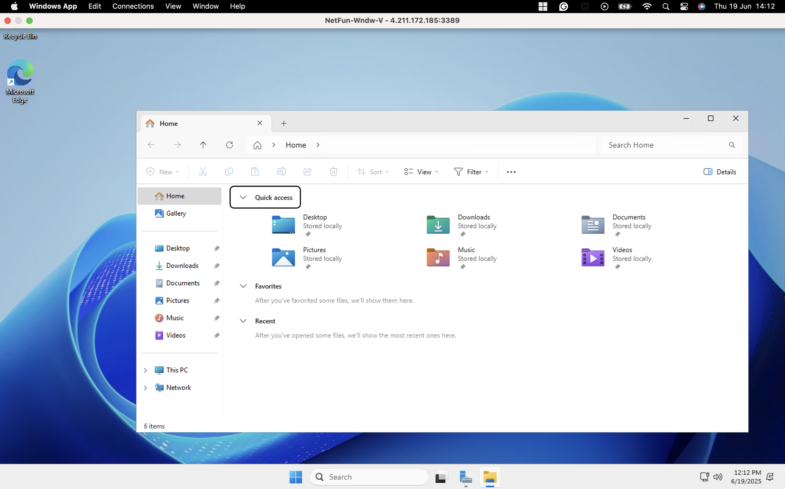

## Title: Deploying and Managing Windows Server on Azure using Azure Bicep

---

### Introduction
In this lab, the goal is to deploy a Windows Server 2025 virtual machine (VM) on Microsoft Azure, explore IP address management, and convert the Azure Resource Manager (ARM) templates into Azure Bicep for reusable infrastructure-as-code (IaC). Despite encountering multiple technical challenges, the exercise provided deep insights into working with Azure, Bicep, regional image availability, and VM generation compatibility.

---

## 1. Launching Windows Server on Azure

### Objective
Deploy a Windows Server 2025 VM on Azure and download its resource template for IaC conversion.

### Procedure
1. Navigate to [https://portal.azure.com](https://portal.azure.com).
2. Click **Create a Resource > Azure Virtual Machine**.
3. Create a **Resource Group** named `net-bootcamp-resource-group`.
4. Configure the VM:
   - Name: `NetFun-Windows-Server`
   - Region: `France Central`
   - Availability option: `Self-selected zone (selected zone 1)`
   - Security type: `Trusted launch virtual machines`

   - Image: `Windows Server 2025 Datacenter: Azure Edition x64 Gen2`
   - Size: B2s (to control cost)
   - Authentication: username = `john_user`, password = `Testing123456!`
   - Public inbound ports: `Allow selected ports`
   - Enable RDP (port 3389)
5. Review and create the VM. Before creating the the VM, move to the `Networking` and check the box for `Delete public IP and NIC when VM is deleted`

> 

6. After deployment, download the **ARM Template** and **Parameters** from the deployment output.

> 

---

## 2. Connecting to the Windows Server VM from macOS

Once the VM is deployed and running, follow these steps below to connect to it using RDP from a Mac:

### Requirements
For macOS system (e.g., MacBook) users like me, you be neediing `Windows App` formmally called `Microsoft Remote Desktop` from the Mac App Store

### Steps

#### Download Microsoft Remote Desktop:
- Visit the [Mac App Store](https://apps.apple.com/us/app/microsoft-remote-desktop/id1295203466?mt=12)
- Search for **\"Windows App\"** or **\"Microsoft Remote Desktop\"** and install it.

#### Get Connection Details:
- From the deployed Virtual Machine.
- Click **Connect**.
- Download the `.rdp` file.

#### Connect to the VM:
- Double-click the newly downloaded `.rdp` file, and you will be prompted to enter the password. Use the same password `Testingn123456!`


- Accept the certificate warning if prompted.
- Wait for the Windows environment to load.

### Confirmation:
You should be successfully connected to the Windows Server desktop.

From here, you can launch **PowerShell** or **Command Prompt** and run `ipconfig` or any other IP address management tools.

> 

---

## 3. Converting and Deploying with Azure Bicep

### Install Azure CLI & Bicep

To begin with this, I ensured the Azure CLI was installed, then signed in and installed the Bicep CLI component:

```bash
curl -sL https://aka.ms/InstallAzureCLIDeb | sudo bash
az login --use-device-code
```

Next, I checked Bicep availability and installed it:
```bash
az bicep version
# Output: Bicep CLI not found...

az bicep install
# Output: Successfully installed Bicep CLI

az bicep version
#Output: Bicep version
```

### Decompile ARM Template to Bicep

Making sure I'm at the working directory: `projects/ip-address-management/templates/vm`, I ran the command below:
```
az bicep decompile --file template.json
```
This generated a template.bicep file in the same folder.


### Review and Refactor Bicep Template
Although the generated file was valid, I updated the hardcoded values to parameters for better reusability.

I removed zone constraints and ensured the computer name was under 15 characters. Here’s a cleaned-up snippet:
```
param location string = 'francecentral'
param vmName string = 'NetFun-Wndw-V'
param adminUsername string = 'john_user'
@secure()
param adminPassword string
```
### Prepare Final Parameters File
Here’s the updated [parameters.json:](./templates/vm/parameters.json)
```code
{
  "$schema": "https://schema.management.azure.com/schemas/2019-04-01/deploymentParameters.json#",
  "contentVersion": "1.0.0.0",
  "parameters": {
    "vmName": {
      "value": "NetFun-Wndw-V"
    },
    "adminUsername": {
      "value": "john_user"
    },
    "adminPassword": {
      "value": "Testing123456!"  // ⚠️ For production use, store this securely in Azure Key Vault
    },
    "location": {
      "value": "francecentral"
    }
  }
}
```
### Deploy the Bicep Template
I deployed the final template using:
```bash
az group create --name net-bootcamp-resource-group --location francecentral

az deployment group create \
  --resource-group net-bootcamp-resource-group \
  --template-file template.bicep \
  --parameters @parameters.json
```
Deployment completed successfully, provisioning the virtual machine and associated resources.


### Verify the Deployment

- Opened the Azure portal.

- Navigated to net-bootcamp-resource-group.

- Confirmed the presence of the VM, disk, NIC, public IP, and VNet.

- Downloaded the .rdp file from the portal.

- Double-clicked the file on my Mac and logged in using:
  - Username: `john_user`

  - Password: `Testing123456!`

- Once inside the server, opened PowerShell and ran: `ipconfig`




---

## 4. Challenges with Image Availability and Region

#### Issue
While trying to redeploy using the new Bicep file, deployment failed due to unavailable image SKUs.

#### Diagnostic
Used Azure CLI to list available images:
```bash
az vm image list \
  --publisher MicrosoftWindowsDesktop \
  --offer windows11 \
  --sku win11-22h2-pro \
  --location canadaeast \
  --all \
  --output table
```

### Findings
- All available images were ARM64 and in preview
- No Gen2-compatible x86 images in Canada East

### Decision
Switch region to `France Central` for more options.

---

## 5. Lessons Learned

- **Region Limitations:** Image availability varies by region and affects compatibility with Gen1/Gen2 VMs.
- **Preview Images:** Most Windows 11 SKUs are still in preview and may not be stable.
- **ARM64 vs x86:** ARM64 images are Gen1 only and pose compatibility concerns.
- **Verbose Templates:** Azure Bicep decompiled files are overly verbose; refactoring is necessary.
- **Deployment Errors:** Common causes include invalid parameters, missing resource groups, and version mismatches.

> 📸 **Screenshot suggestion:** Final Azure deployment error output.

---

## 8. Conclusion

Despite several hours of effort, full deployment using the Azure Bicep template was not achieved. Key takeaways include:

- Always validate image compatibility and availability per region before deployment.
- Simplify and validate Bicep templates for readability and reusability.
- Manual configuration may be needed to complement IaC when preview features or regional constraints block progress.
- Terraform may offer a more stable experience for cross-region and multi-platform deployment.

---

### Appendix
- [`template.json`](./templates/vm/template.json) : Original ARM template
- [`parameters.json`](./templates/vm/parameters.json): Refactored parameters for Bicep
- [`template.bicep`](./templates/vm/template.bicep): Decompiled and refactored Azure Bicep file

---
---

**`Instructor`:** [**Andrew Brown**](https://github.com/omenking) 

**`Written/Summarized`:**
[**John Itopa ISAH**](https://github.com/johnitopaisah)

