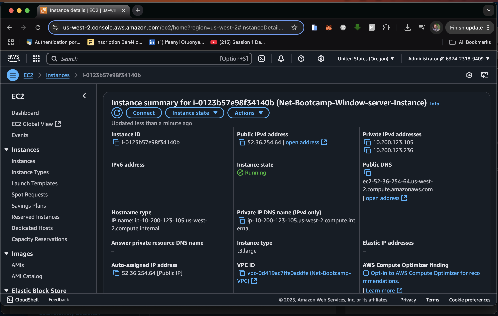
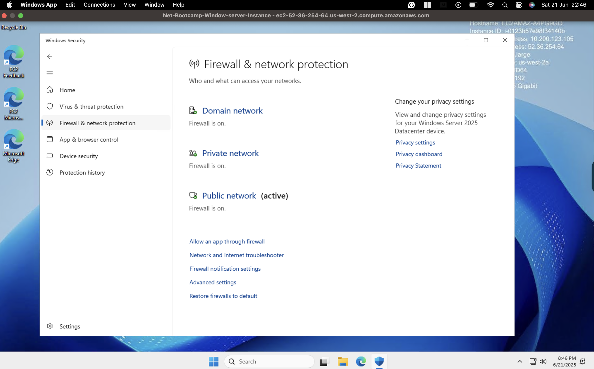
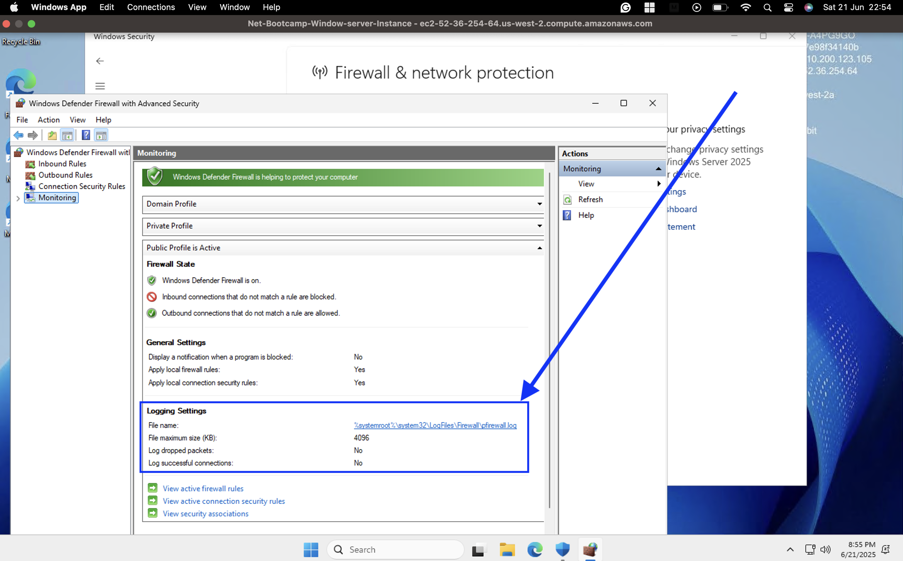
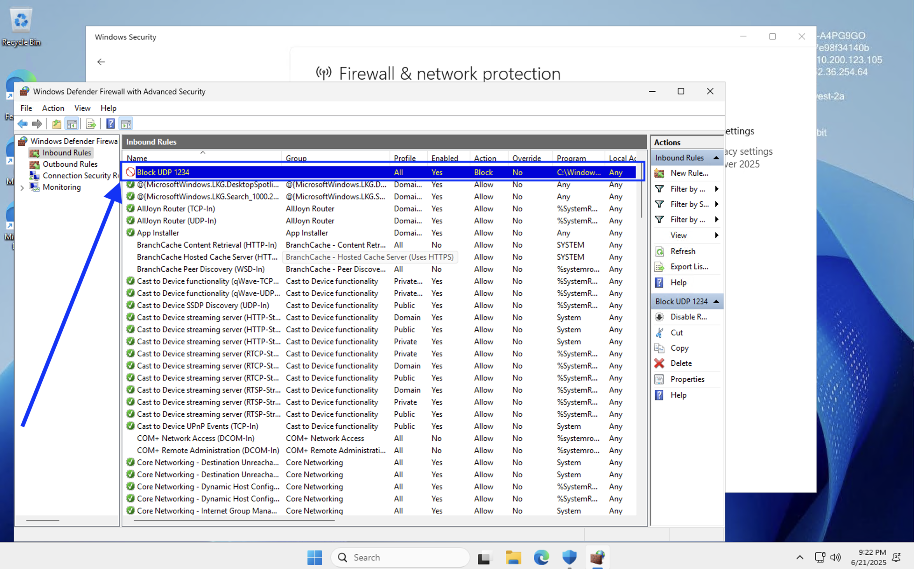
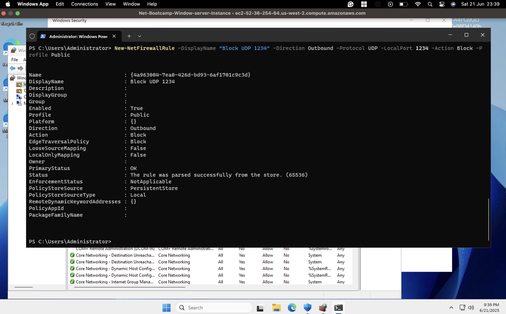
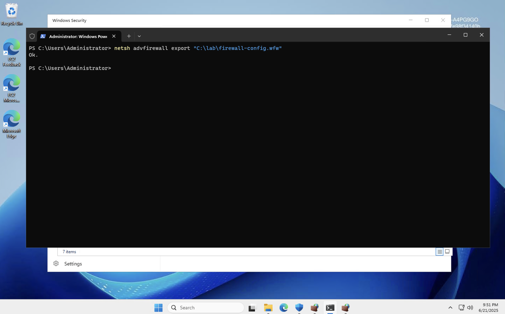

# 🧱 Windows Firewall - Configuration & Rule Management Lab

## 1. ✨ Introduction

### What is Windows Firewall / Windows Defender Firewall?

**Windows Firewall** (now officially known as **Windows Defender Firewall**) is a built-in host-based security tool in Windows that monitors and controls incoming and outgoing network traffic. It enforces security rules based on application, port, and IP address, and plays a vital role in protecting systems from unauthorized access and network-based threats.

### Purpose of the Lab and Target Audience

This lab walks through key firewall concepts, configuration methods, and rule creation—both via GUI and PowerShell. It is intended for:

- Networking and cybersecurity beginners  
- IT bootcamp students  
- Windows administrators  
- Learners preparing for hands-on roles in system/network security

## 2. 🎯 Learning Objectives

By the end of this lab, you will:

- Understand host-based firewall concepts  
- Differentiate between Domain, Private, and Public profiles  
- Configure inbound and outbound rules  
- Use PowerShell to manage firewall settings  
- Create, modify, and test firewall rules for ICMP, ports, and applications  
- Export and import firewall policy settings  

---

## 3. 🛠️ Lab Setup

### Recommended Environment

To replicate the lab, you can use any of the following envirnments;

- **AWS EC2**: Windows Server 2025 with Public/Private subnets  
- **Hyper-V**: Use two internal switches to simulate network isolation  
- **Local VirtualBox/VMware**: Configure NAT and bridged network adapters  



### Tools Required

- Windows OS (10/11/Server 2016+)  
- Admin access to Windows Defender Firewall  
- PowerShell (v5+)  
- Internet access (for testing DNS/ping rules)

## 4. 🧱 Core Concepts

### What is a Host-based Firewall?

A **host-based firewall** runs locally on the OS and filters traffic per machine. It protects the host regardless of the network perimeter.

### Profiles: Domain, Private, Public

- **Domain**: Joined to an AD domain (internal network)  
- **Private**: Trusted home or work networks  
- **Public**: Untrusted networks like coffee shops, airports  

Each profile has independent rule sets and settings.

### Network Profile Selection Behavior

Windows selects a profile based on the network location. For example:

- A system on `corp.local` (joined to a domain controller) → **Domain Profile**  
- Ethernet on `192.168.x.x` without a domain → **Private Profile**  
- Wi-Fi hotspot → **Public Profile**



---

## 5. ⚙️ Windows Firewall Settings Overview

### Turning Profiles On/Off

Each profile can be independently enabled or disabled via:

- **Control Panel**  
- **Windows Security** > Firewall & Network Protection  
- **PowerShell** (`Set-NetFirewallProfile`)

### Inbound vs Outbound Rules

- **Inbound Rules**: Allow/deny traffic coming *into* the system  
- **Outbound Rules**: Control traffic *leaving* the system  
- Most outbound traffic is allowed by default; most inbound is blocked.

### Default Behavior

- **Public profile**: Most secure  
- **Domain/Private profiles**: More permissive

### Notification and Unicast Settings

- Enable/disable notifications when apps are blocked  
- Filter unicast responses to multicast or broadcast

### Logging Settings

- Log dropped and allowed packets  
- Set max log file size and location (`pfirewall.log`)


---

## 6. 🔐 Inbound and Outbound Rules

### Inbound Rules and Use Cases

- **ICMP Echo Request (Ping)**: Enabled only on Private profiles  
- **Block ping on Public profile** for security

### Per-Profile Rule Configuration

You can enable rules for specific profiles only:

- Allow ping on **Private** only  
- Block file sharing on **Public**

### Program-based Inbound Rules

- Allow `notepad.exe` or any `.exe` to receive incoming traffic  
- Useful for custom applications or testing scenarios

### Outbound Rules (Botnet Prevention)

- Block traffic on known malicious outbound ports (e.g., `UDP 1234`)  
- Prevent command-and-control communication or unauthorized uploads


---

## 7. 💻 Working with Rules

### Creating a New Rule (Step-by-step)

1. Open **Windows Defender Firewall with Advanced Security**  
2. Navigate to **Inbound Rules** or **Outbound Rules**  
3. Click **New Rule** and follow the wizard:

   - Choose rule type (Program, Port, Predefined, Custom)  
   - Define protocol/port or application path  
   - Select profiles (Domain, Private, Public)  
   - Specify allow/block action  

### Types of Rules

- **Program**: Filter traffic to/from a specific `.exe`  
- **Port**: Control traffic by port number (TCP/UDP)  
- **Custom**: Fine-tune rules with conditions (user, service, scope)

### Rule Scope and Security Filtering

- Define **Local IP** and **Remote IP** scope  
- Apply **IPSec requirements** or **authentication**

## 8. 🧪 Lab Exercises & Scenarios

- Enable/Disable firewall profiles and observe traffic changes
- Add an inbound rule to allow ICMP (ping) on **Private** only
- Block outbound traffic on port **1234/UDP** to simulate botnet defense
- Allow inbound traffic to a test app like `notepad.exe`
- Modify or delete existing rules via GUI


---

## 9. ⚡ PowerShell Integration

### Basic PowerShell Commands

```powershell
Get-NetFirewallProfile
Set-NetFirewallProfile -Profile Public -Enabled False
```

### Create Rules via CLI
```powershell
New-NetFirewallRule -DisplayName "Allow Notepad" -Direction Inbound -Program "C:\Windows\System32\notepad.exe" -Action Allow -Profile Private

New-NetFirewallRule -DisplayName "Block UDP 1234" -Direction Outbound -Protocol UDP -LocalPort 1234 -Action Block -Profile Public
```

## 10. 📅 Importing and Exporting Policies
### Export Firewall Configuration
```cmd
netsh advfirewall export "C:\lab\firewall-config.wfw"
```

### Group Policy Overview
If domain-joined, firewall rules can be managed via Group Policy Objects (GPOs) under:

`Computer Configuration > Policies > Windows Settings > Security Settings > Windows Defender Firewall`

## 11. 📌 Best Practices & Troubleshooting

- Use logging only when needed (drops/successes)
- Temporarily enable rules to isolate connectivity problems
- Disable firewall temporarily in **cloud environments** only when absolutely safe
- Compare rule behavior across profiles (**Domain** vs **Public**)

---
## 7. 👤 Credits
- **Instructor**: Special thanks to **Tim**, who guided us through the lecture and the hands-on Packet Tracer simulation with clarity and attention to detail.

- **Lecture Source**: Official bootcamp session on basic networking using Cisco Packet Tracer.

- **Contributors**: [`README.md`](README.md) and [`Journal.md`](Journal.md) authored and maintained by [**John Itopa ISAH**](https://github.com/johnitopaisah)


