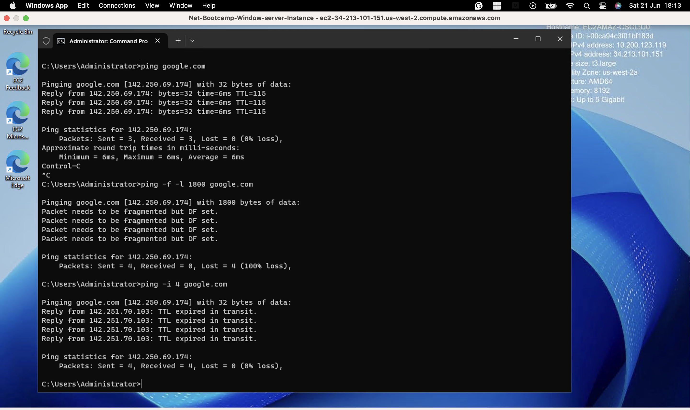
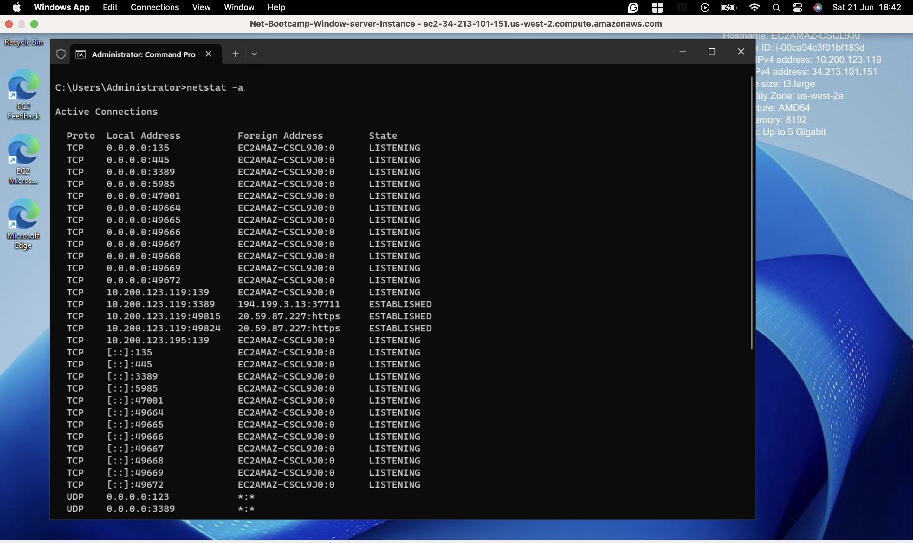
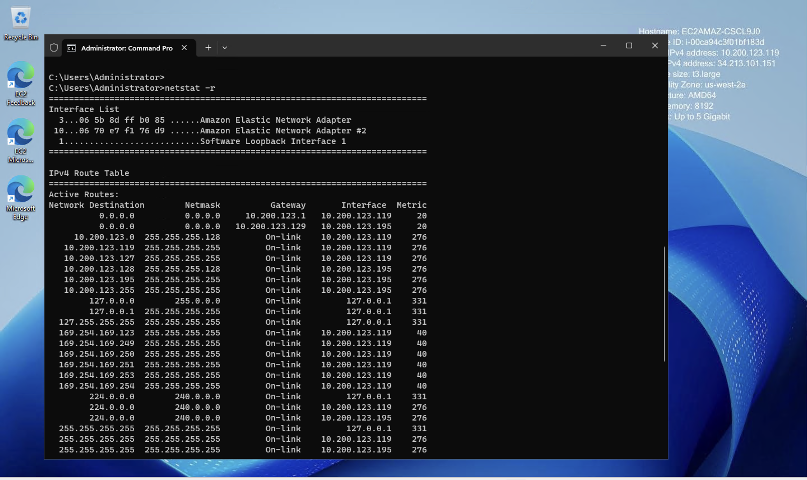
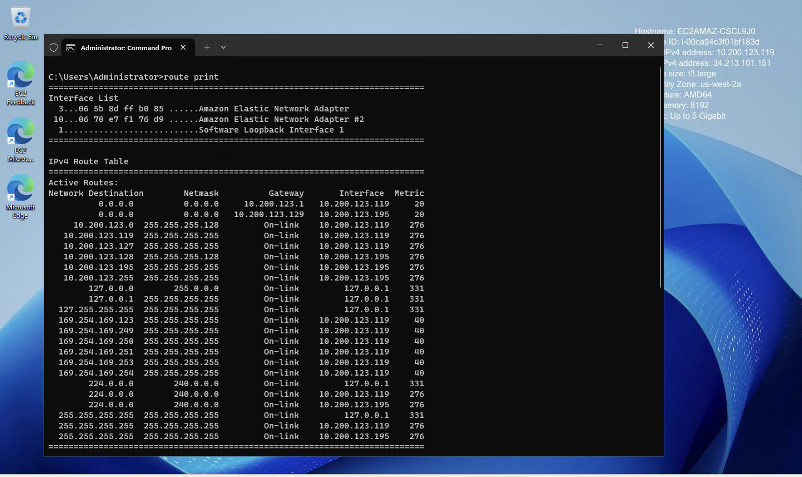
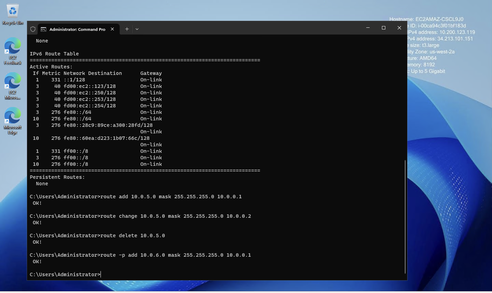
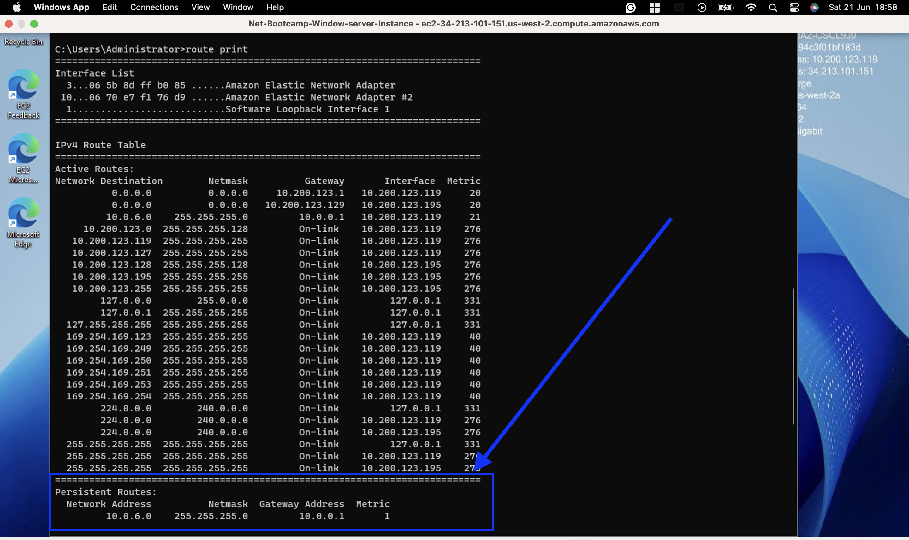

# Windows Networking Tools - Troubleshooting Guide

## 1. ✨ Introduction

### Purpose of the Project

This project aims to document and demonstrate the usage of essential Windows networking tools used for troubleshooting and analyzing network-related issues. Whether you're managing a home computer, a cloud VM, or an enterprise server, these tools offer deep insights into your machine's network stack and connectivity.

### Scope of Tools Covered

This guide covers built-in command-line tools in Windows for performing common networking diagnostics:

- `ipconfig`
- `ping`
- `tracert`
- `nslookup`
- `netstat`
- `route`

### Target Audience

- Networking beginners and self-learners
- IT bootcamp students
- Junior system administrators
- Anyone working with Windows servers or VMs (e.g., on AWS EC2 or Hyper-V)

---

## 2. ⚖️ Prerequisites

### Operating System Requirements

- Windows 10/11 or Windows Server 2016 and above
- Administrative command prompt access (for full capabilities)

### Network Setup

This project supports multiple deployment environments:

- **Local machine** with multiple NICs
- **Virtual machines** (Hyper-V, VirtualBox, VMware)
- **Cloud platforms** (e.g., AWS EC2 Windows instances)

### Tools/Access Needed

- Command Prompt (Admin)
- Internet access (for DNS and route testing)
- Permissions to release/renew IP addresses

---

## 3. 🔧 Core Windows Networking Tools

### 🔧 `ipconfig`

#### Basic Usage

Displays IP address, subnet mask, and default gateway of all adapters:

```bash
ipconfig
```
#### Common Flags
`/all` - Show detailed adapter info (DHCP lease, DNS suffix, MAC, etc.)

`/release` - Drop current DHCP lease (IPv4)

- `/release6` - Drop current DHCP lease (IPv6)

- `/renew` - Request a new IP from DHCP (IPv4)

- `/renew6` - Request a new IP from DHCP (IPv6)

- `/flushdns` - Clear DNS resolver cache

- `/registerdns` - Refresh DHCP lease and re-register DNS name

#### Real-world Troubleshooting Scenarios
- **No internet access:** Use `/release` and `/renew`

- **DNS resolution problems:** Use `/flushdns`

- **Changed local DNS records not resolving:** Use `/registerdns`


### 📦 ping

#### Verifying Host Reachability
Basic command:
```bash
ping google.com
```
#### Options
- `-t` - Continuous ping (use Ctrl+C to stop)

- `-a` - Resolve IP to hostname

- `-n` - Set number of echo requests (e.g., -n 5)

- `-l` - Set packet size (e.g., -l 1000)

- `-f` - Set "Don't Fragment" flag for MTU discovery

- `-i` - Set TTL (Time-To-Live)
#### Fragmentation & MTU Discovery
Use `-f -l 1800` to test if packets exceed MTU (Ethernet = 1500 bytes):
```bash
ping -f -l 1800 google.com
```
Expect an error if fragmentation is not allowed and MTU is exceeded.
#### TTL and Hop-based Troubleshooting
```bash
ping -i 4 google.com
```
Returns TTL Expired error if the host is beyond 4 hops.



### 🗱 tracert
Mapping the Route to a Host
```bash
tracert google.com
```
Shows the path packets take through the network.

#### Diagnosing Network Latency and Path Issues
- Long delays on specific hops indicate possible routing issues

- `Request Timed Out` suggests ICMP is blocked, not necessarily failure

#### Hop Limit and Timeout Configurations
```bash
tracert -h 10 -w 5 google.com
```
- `-h` sets max hops (default 30)

- `-w` sets timeout (in ms)

### 🌐 nslookup
#### DNS Server Identification
```bash
nslookup
```
Displays the default DNS server in use.

#### Querying Domains
```bash
> www.cnn.com
```
Returns associated IPs.

#### Changing DNS Server for Lookup
```bash
> server 8.8.8.8
> www.cnn.com
```
Compare results between internal and public DNS.

#### Comparing DNS Records Across Providers
Helps verify propagation issues or misconfigured internal DNS servers.


### 🛡️ netstat
#### Viewing Active Connections
```bash
netstat -a
```
Lists all active TCP/UDP connections and listening ports.

#### Filtering by Protocol, App, and Port
```bash
netstat -b -n -p tcp
```
- `-b:` Show the app initiating each connection

- `-n:` Show IP addresses instead of domain names

- `-p tcp:` Filter by protocol

#### Listening Ports and Routing Table Insights
```bash
netstat -r
```
Displays the routing table (same as `route print`)





### 🚣 route
#### Viewing the Routing Table (`route print`)
```bash
route print
```
Shows IPv4, IPv6, and persistent routes.
#### Adding, Modifying, and Deleting Routes
```bash
route add 10.0.5.0 mask 255.255.255.0 10.0.0.1
route change 10.0.5.0 mask 255.255.255.0 10.0.0.2
route delete 10.0.5.0
```
#### Persistent vs Non-Persistent Routes
```bash
route -p add 10.0.6.0 mask 255.255.255.0 10.0.0.1
-p flag ensures the route survives system reboots.
```
#### **Use Case:** Multiple NICs and Custom Paths
Useful when connecting to isolated subnets over private NICs.







---

## 4. 🤮 Practical Use Cases

- **Diagnosing DNS Issues:** Use `nslookup`, `ipconfig /flushdns`, and compare different DNS servers.
- **Identifying MTU-Related Application Failures:** Use `ping -f -l <size>` to identify MTU bottlenecks.
- **Validating Routing Behavior in Dual-NIC Systems:** Use `route add -p` to direct traffic via specific interfaces.
- **Checking for Suspicious Connections on a Host:** Use `netstat -b` to view unexpected outgoing/incoming connections.

---

## 5. ⚠️ Common Pitfalls and Security Considerations

### ICMP/Ping Restrictions in Modern Networks

Many networks block ICMP to prevent abuse (e.g., DoS, Smurf attacks).  
Don't assume `ping` or `tracert` failures always mean connectivity issues.

### DNS Caching and Propagation Delays

Stale entries in the resolver cache may cause failed connections.  
Use `ipconfig /flushdns` to force refresh.

### Risks of Misconfigured Static Routes

Manual routes can cause lost connectivity or create traffic blackholes.  
Always test routing changes in a safe environment.

### Best Practices for Safe Testing

- Use virtual machines or non-critical devices
- Avoid modifying default routes
- Document changes and have rollback plans

---

## 6. 🏠 Lab Environment (Optional Section)

### Setting Up a Virtual Lab

- **AWS EC2**: Launch a Windows Server 2025 instance with both public and private IPs to test dual-NIC scenarios.
- **Hyper-V**: Create internal and external virtual switches to simulate routing and network segmentation.
- **VMware/VirtualBox**: Use a combination of bridged and NAT network adapters to emulate a segmented network environment.

---

## 7. 👤 Credits
- **Instructor**: Special thanks to **Tim**, who guided us through the lecture and the hands-on Packet Tracer simulation with clarity and attention to detail.

- **Lecture Source**: Official bootcamp session on basic networking using Cisco Packet Tracer.

- **Contributors**: [`README.md`](README.md) and [`Journal.md`](Journal.md) authored and maintained by [**John Itopa ISAH**](https://github.com/johnitopaisah)
